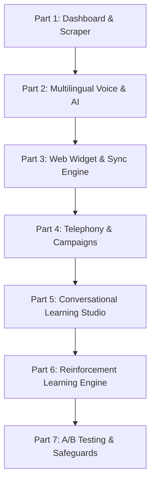

# Phased Execution Plan: AI Telecaller Voice Agent

This document outlines a highly incremental, phased execution plan to build the **AI Telecaller Voice Agent** system. 

Each phase is designed to be completed in a single session (approximately 2–4 hours of development). Crucially, **after every single phase, the application is fully runnable**. At the end of each phase, you will have a working interface or tool that you can open, interact with, see the results, and verify before choosing to proceed.

---

## Roadmap Overview

---

## Part 1: Admin Dashboard & Knowledge Base Foundation

### Phase 1: Project Skeleton & Brand Dashboard UI
*   **Goal**: Set up the project repository, build systems, and a premium-looking Admin Dashboard UI container.
*   **What to Build**:
    *   Initialize backend structure (FastAPI) and frontend application (Next.js 14 + Tailwind CSS + shadcn/ui).
    *   Create the shell of the Admin Dashboard featuring a sidebar navigation (Companies, Campaigns, Call Logs, Learning Studio, RL Engine).
    *   Create a "Companies" list page displaying mock company profiles (including **Bridgeon Skillversity**).
    *   Build a "Create Company Profile" form with fields for Company Name, Website URL, Tone of Voice (Friendly, Professional, Formal), Agent Name, and Escalation Phone Numbers.
*   **What you can Open, See, and Test**:
    *   Start the local development server and open `http://localhost:3000` in the browser.
    *   Navigate the dashboard, open the "Create Company Profile" form, type in details, click save, and see it populate in the local UI state.

### Phase 2: Web Scraper & Site Indexer Backend
*   **Goal**: Implement the headless web crawler to extract clean text from a target URL.
*   **What to Build**:
    *   Integrate a headless scraper module (using Crawlee or Firecrawl API) in the FastAPI backend.
    *   Add a backend worker queue (using simple background tasks or Celery/Redis) to handle scraping asynchronously.
    *   Add a "Crawler Status Tracker" in the frontend. Clicking "Crawl Website" on a company profile sends the URL to the backend, updates the UI to show `Crawling...`, and displays the extracted page titles and character counts.
*   **What you can Open, See, and Test**:
    *   Enter a real website URL (e.g., `bridgeon.in`) in your UI, hit "Sync Now".
    *   Watch a real-time progress bar/spinner change from `Queued` to `Crawling` to `Completed`.
    *   See a list of crawled URLs with extracted page titles, meta descriptions, and clean text lengths populated in the dashboard database.

### Phase 3: RAG Pipeline with Vector DB (Local/pgvector)
*   **Goal**: Chunk crawled text, embed it, and store it in a vector database for similarity search.
*   **What to Build**:
    *   Implement a text splitter (e.g., chunk size 512, overlap 50) and integrate the OpenAI/Claude embedding API.
    *   Set up a local pgvector database (using Docker) or a Pinecone namespace to store the generated embeddings.
    *   Create a "Knowledge Base Namespace Manager" UI for each company profile.
    *   Add a manual search box in the dashboard where the admin can type a query and view the top-5 retrieved text chunks with their matching confidence scores.
*   **What you can Open, See, and Test**:
    *   Crawl a page, wait for indexing to complete, then navigate to the "Knowledge Base" tab.
    *   Type a search term (e.g., "MERN Stack fees" or "Bridgeon location") in the manual search box.
    *   Verify that the retrieved chunks are relevant and display the exact scraped website paragraphs.

### Phase 4: Vector Database FAQ Editor (CRUD)
*   **Goal**: Allow admins to manually override, insert, or delete knowledge base chunks without re-crawling.
*   **What to Build**:
    *   Build an "FAQ & Knowledge Chunk Editor" grid in the Admin Dashboard.
    *   Implement CRUD endpoints in the backend to create, update, or delete entries directly in the vector database.
    *   Add a tag filter to group chunks (e.g., `#fees`, `#placement`, `#duration`).
*   **What you can Open, See, and Test**:
    *   Open the Knowledge Base list, click "Add Custom Chunk", and type in a question/answer (e.g., a special promo discount).
    *   Run the manual search box from Phase 3 again and verify that the manually added chunk is returned first.
    *   Edit an existing chunk, save it, and verify that the search results update instantly.

---

## Part 2: Multilingual Voice & AI Integration

### Phase 5: Dashboard AI Playground (Text Chat & RAG)
*   **Goal**: Connect the LLM (Claude Sonnet) to the vector database and create a chat simulator.
*   **What to Build**:
    *   Implement the core prompt routing engine. When a message is sent, query the vector database for context, construct a system prompt enforcing the agent's persona and constraints, and send it to the Claude API.
    *   Add an "AI Agent Playground" panel in the Admin Dashboard. This is a conversational text interface styled like a chat messenger.
    *   Add a toggle to switch between different company personas and tones.
*   **What you can Open, See, and Test**:
    *   Open the Playground, select "Bridgeon Skillversity" (Friendly tone), and type "What courses do you offer?".
    *   Verify the AI responds strictly using facts from the crawled pages, maintaining a friendly tone.
    *   Try to trick the AI into giving information not in the knowledge base (e.g., "Tell me about your branch in Mars"); verify it says "I'll have our counselor get back to you on that" instead of hallucinating.

### Phase 6: WebRTC Browser-based Voice Sandbox
*   **Goal**: Enable voice communication in the playground using browser-based Speech-to-Text and Text-to-Speech.
*   **What to Build**:
    *   Add a microphone button to the Dashboard Playground.
    *   Integrate browser native Web Speech API (or Deepgram STT/browser TTS) to capture mic input, transcribe it to text, send it to the RAG LLM pipeline, and read out the response.
    *   Create a pulsing voice waveform animation in the UI to indicate states: `Listening`, `Thinking`, `Speaking`.
*   **What you can Open, See, and Test**:
    *   Open the Playground, click the microphone icon, grant permission, and say "Tell me about the React program".
    *   Watch your words transcribe in real-time, see the "thinking" wave, and hear the browser speak back the LLM's response.

### Phase 7: Sarvam AI Integration (Fluent Malayalam Voice)
*   **Goal**: Integrate Sarvam AI for high-accuracy Malayalam STT (`saarika:v2`) and natural-sounding TTS (`bulbul:v1`).
*   **What to Build**:
    *   Connect the backend voice pipeline to Sarvam AI APIs.
    *   Update the backend to accept raw audio packets (PCM 16kHz) from the frontend, stream them to Sarvam's Malayalam STT, pass the transcription to the LLM (instructed to respond in Malayalam text/transliteration), and stream the output to Sarvam Malayalam TTS.
    *   Support Code-Switching ("Manglish"): configure the STT and LLM prompts to handle a mix of Malayalam and English dynamically.
*   **What you can Open, See, and Test**:
    *   Select "Malayalam" in the playground settings.
    *   Speak in Malayalam (e.g., "MERN Stack course-ന്റെ ഫീസ് എത്രയാണ്?").
    *   Verify the transcription handles Malayalam correctly and that the voice returned speaks in natural, local Kerala Malayalam cadence.

---

## Part 3: Zero-Interference Web Widget & Sync Engine

### Phase 8: Shadow DOM Web Widget (Static Chat UI)
*   **Goal**: Build the self-contained floating web widget that client websites can import with a single script tag.
*   **What to Build**:
    *   Create a `loader.js` script containing the widget client code.
    *   Use Web Components and **Shadow DOM** to create a custom HTML element (`<bridgeon-agent-widget>`).
    *   Style a floating launcher button in the bottom right, expanding into a chat window upon click. Ensure all CSS is strictly contained inside the Shadow DOM (no leakage).
    *   Add text chat inputs and a WebRTC voice capture module in the widget.
*   **What you can Open, See, and Test**:
    *   Create a dummy static HTML page containing only the `` snippet.
    *   Open this HTML file locally. Verify that the floating widget button appears, clicks open, asks for microphone access, and displays its own clean UI style without breaking the host page.

### Phase 9: Real-time SPA Route & Content Observer
*   **Goal**: Detect dynamic content updates on client pages without manual sitemap submissions.
*   **What to Build**:
    *   Implement a **MutationObserver** inside `loader.js` to watch the host page's DOM container.
    *   When a dynamic route transition (like standard SPA React/Next.js client-side routing) occurs, compute a hash of the main content wrapper.
    *   If the hash changes, send a lightweight webhook signal `/api/sync/observer` back to the backend.
    *   Create a "Dynamic Observer Logs" dashboard view in the Admin panel.
*   **What you can Open, See, and Test**:
    *   Run your static test page, simulate a route change or page content update by injecting text dynamically using the browser developer console.
    *   Verify that the "Dynamic Observer Logs" panel in the Admin Dashboard instantly appends a log showing the new URL, content hash, and target sync queue timestamp.

### Phase 10: Auto-Sync Engine & Page Diffing
*   **Goal**: Parse change signals and surgically update changed vector chunks instead of re-indexing the entire site.
*   **What to Build**:
    *   Create the crawler scheduling pipeline (polling `sitemap.xml` every 15 minutes, scheduled full daily crawl).
    *   Build a comparison engine that hashes the clean text of individual crawled pages and compares it to stored database hashes.
    *   If hashes differ, diff the text, identify modified paragraphs, remove outdated vector chunks for that specific page, and embed/insert new ones.
*   **What you can Open, See, and Test**:
    *   Modify a mock webpage on your local server.
    *   Wait for the 15-minute sitemap poll or click "Sync Now".
    *   Open the Admin Dashboard "Sync Log" and verify it says: `1 page changed, 2 chunks re-indexed, 0 chunks untouched`.
    *   Confirm the AI agent immediately answers using the updated information.

---

## Part 4: Telephony Integration & Outbound Campaigns

### Phase 11: Inbound Telephony Hook (Exotel/Twilio Core)
*   **Goal**: Connect the voice agent to the real telephone network for inbound calls.
*   **What to Build**:
    *   Set up webhooks to receive call connection requests from a telephony provider (Exotel or Twilio).
    *   Configure the telephony server to exchange live audio streams with our FastAPI backend using WebSockets.
    *   Stream incoming telephone audio packets into the Sarvam AI/LLM/TTS pipeline, and stream the generated TTS audio back to the telephony server.
*   **What you can Open, See, and Test**:
    *   Use a softphone client (or a test phone number provided by Twilio/Exotel).
    *   Dial the assigned virtual number.
    *   Say "hello" and carry out a basic conversation over a real phone line. Verify that the bot listens, processes, and speaks back through the phone speaker.

### Phase 12: Call State Machine & Human Warm Transfer
*   **Goal**: Manage complex call stages (Hold, Silence, and warm transfers to human agents).
*   **What to Build**:
    *   Build a telephony call state tracker (States: `greeting`, `interacting`, `holding`, `escalating`, `bridging`, `ended`).
    *   Implement the **Warm Transfer Flow**: when the user says "connect me to a human" or the LLM flags frustration, hold the customer call, dial the configured escalation number, play a 10-second audio summary to the human ("*Rahul is asking about the MERN stack in Malayalam*"), and then bridge the lines.
*   **What you can Open, See, and Test**:
    *   Call the virtual number. Mid-conversation, say "I want to talk to a manager".
    *   Listen to the bot say "Connecting you right away", hear it place you on hold, watch the dashboard show the call state shifting to `escalating`.
    *   Receive the second call on your configured escalation phone, hear the synthesized briefing, and verify the two lines bridge together.

### Phase 13: Outbound Campaign Manager UI & CSV Upload
*   **Goal**: Create outbound campaigns by uploading lead lists.
*   **What to Build**:
    *   Create a "Campaigns" section in the Admin Dashboard.
    *   Build a "New Campaign" screen where the admin can name a campaign, upload a CSV list of leads (columns: Name, Phone Number, Language Preference, Interest Tag), select a target company profile, and define calling windows (e.g., 10 AM - 6 PM IST).
    *   Implement the lead database schema to track calling status (`not_contacted`, `busy`, `answered`, `failed`).
*   **What you can Open, See, and Test**:
    *   Prepare a mock CSV containing 5 test phone numbers.
    *   Go to "Campaigns", click "Create Campaign", upload the CSV, configure hours, and hit save.
    *   See the dashboard populate with progress trackers (e.g., `0/5 Calls Made`, progress bar, and list of leads marked `Pending`).

### Phase 14: Outbound Campaign Dialer & Retry Engine
*   **Goal**: Automate outbound cold calling with campaign rules.
*   **What to Build**:
    *   Implement a background campaign manager queue that checks calling windows and schedules outbound calls using the Exotel/Twilio API.
    *   Implement campaign retry logic: automatically retry busy or unanswered calls up to 3 times, spaced out at configured intervals.
    *   Update the call script handler: when a customer answers, greet them directly ("*Hi [Name], I'm Priya calling from Bridgeon...*").
*   **What you can Open, See, and Test**:
    *   Set the campaign window to active, click "Start Campaign".
    *   Receive the outbound call on your phone. Answer it, verify the bot addresses you by name.
    *   Let a call go unanswered; verify the dashboard schedules a retry for that specific lead in the queue database.

### Phase 15: Post-Call Reports & Google Sheets Sync
*   **Goal**: Transcribe calls, generate summaries, and sync data automatically to spreadsheets.
*   **What to Build**:
    *   Implement a post-call background worker to:
        *   Save raw telephony audio to AWS S3.
        *   Ask Claude to generate a 3-line summary, sentiment rating (Positive/Neutral/Negative), and outcome status (Interested/Callback/Escalated).
        *   Sync the metrics as a new row in a connected Google Sheet via Google Sheets API.
    *   Build a "Call Logs" view in the Admin Dashboard showing list of calls, play audio button, AI summary, and sheet sync status.
*   **What you can Open, See, and Test**:
    *   Complete a test call.
    *   Open the "Call Logs" tab in your Admin Dashboard, listen to the recording, and read the generated summary.
    *   Open your linked Google Sheet and verify that a new row has automatically appended with all call metrics.

---

## Part 5: Conversational Learning Studio

### Phase 16: Learning Studio & Audio Upload UI
*   **Goal**: Build the upload portal for human-to-human call recordings.
*   **What to Build**:
    *   Build a "Learning Studio" section in the Admin Dashboard.
    *   Create a drag-and-drop file uploader supporting `.mp3`, `.wav`, `.mp4` up to 500MB.
    *   Add metadata inputs for the uploaded files: Label, Outcome (Enrolled/Interested/Not Interested), Call Direction, and Call Rating (1–5 stars).
*   **What you can Open, See, and Test**:
    *   Open the Learning Studio page, drag in a test audio file, select "5 Stars" and "Enrolled", and click "Upload".
    *   Verify the upload shows a progress bar, finishes, and lists the file in the "Learning Sets" database.

### Phase 17: Recording Transcription & Diarization Pipeline
*   **Goal**: Automatically split speaker channels and transcribe human conversations.
*   **What to Build**:
    *   Integrate a speaker diarization library (e.g., `pyannote/speaker-diarization`) to divide files into `AGENT` and `CUSTOMER` channels.
    *   Send audio segments through the Sarvam AI STT pipeline to output time-stamped text.
    *   Build an "Interactive Transcript Editor" in the UI: displays audio wave synced to timestamped text bubbles; clicking a text block plays the corresponding audio.
*   **What you can Open, See, and Test**:
    *   Upload a file and wait for processing to complete.
    *   Open the recording log in the Learning Studio.
    *   Read the transcript showing `[00:12] AGENT: ...` and `[00:18] CUSTOMER: ...` and click on any sentence to hear that exact snippet play back.

### Phase 18: Tone & Prosody Analysis Engine
*   **Goal**: Analyze voice characteristics of top-performing human agents.
*   **What to Build**:
    *   Integrate audio processing libraries (`librosa`, `parselmouth`) in the backend to extract speech characteristics: speaking rate (words/min), pitch mean/range, energy variance, and pauses.
    *   Compare 5-star calls against 1-star calls to calculate a target "Tone Profile" representing the optimal pacing and energy.
    *   Display a "Tone Profile Visualization" chart in the Learning Studio dashboard.
*   **What you can Open, See, and Test**:
    *   Open the details page of an analyzed recording.
    *   View stats (e.g., "Pace: 120 words/minute, Pause duration: 0.6s, Pitch: Warm").
    *   See the comparative chart showing your high-performing tone benchmarks.

### Phase 19: Content & Phrase Mining (Power / Drop Phrases)
*   **Goal**: Mine text scripts to identify phrases that drive conversions or trigger drop-offs.
*   **What to Build**:
    *   Write a text analytics service that scans transcripts of positive vs negative outcomes.
    *   Extract statistically significant text patterns:
        *   **Power Phrases**: common in successful calls.
        *   **Drop Phrases**: common in hang-ups.
    *   Display these in the Learning Studio UI as "Suggested Power Phrases" (to add to prompt instructions) and "Drop Phrases" (to inject into LLM negative constraints).
*   **What you can Open, See, and Test**:
    *   Process a batch of 10 test transcripts.
    *   Open the "Phrase Mine" view. Verify it lists phrases like "*We can secure a spot for you*" under high-conversion, and "*We don't offer discounts*" under negative-outcomes.

### Phase 20: Auto-Generated Objection Playbook
*   **Goal**: Automatically extract objections and map the winning responses.
*   **What to Build**:
    *   Use LLM processing to classify customer segments in transcripts containing objections (e.g., pricing, time, credentials).
    *   Map the subsequent agent response, calculate the success rate (outcome win %), and build a structured "Objection Playbook" database table.
    *   Build a playground view where the admin can review, edit, or override any mapped objection response.
*   **What you can Open, See, and Test**:
    *   Navigate to the "Objection Playbook" tab.
    *   See the list of auto-extracted objections (e.g., "*Too expensive*") mapped to the best agent responses (e.g., "*Acknowledge -> share EMI options*") along with calculated win percentages.

### Phase 21: Conversational Learning Integration Loop
*   **Goal**: Automatically inject extracted phrases, tone models, and objections into the live agent.
*   **What to Build**:
    *   Create a compilation engine that updates LLM system prompts by appending the mined Playbooks and Power/Drop phrases.
    *   Inject the extracted Tone Profile parameters into the Sarvam AI TTS request payload.
    *   Build a "Review & Approve Updates" screen in the dashboard, showing the exact diff of what will change in the agent's prompts and settings.
*   **What you can Open, See, and Test**:
    *   Run a learning cycle on your recordings.
    *   Open the "Review & Approve" screen, see the prompt updates, and click "Approve".
    *   Start a voice call in the playground; verify the agent begins using the newly learned phrases and TTS prosody adjustments.

---

## Part 6: Reinforcement Learning (RL) Engine

### Phase 22: Markov Decision Process (MDP) State Tracker
*   **Goal**: Model and track conversation states in real time during a call.
*   **What to Build**:
    *   Define the conversation state vector schema: conversation phase (Opening, Discovery, Pitch, Objections, Closing), customer sentiment (Positive, Neutral, Negative), objections raised, duration, and user segment.
    *   Build a real-time state classifier service that evaluates each turn and saves it to a database state log.
    *   Add a "Live State Monitor" widget in the dashboard call log.
*   **What you can Open, See, and Test**:
    *   Make a test call in the playground.
    *   Refresh the call details. Verify it displays the turn-by-turn state changes (e.g., `Turn 1: Opening/Neutral -> Turn 2: Discovery/Positive -> Turn 3: Pitch/Neutral`).

### Phase 23: Composite Reward Engine & temporal difference credit assignment
*   **Goal**: Calculate numerical call rewards and distribute credit to individual turns.
*   **What to Build**:
    *   Implement the post-call reward calculator using the composite formula:
        *   *Outcome Rewards* (+1.0 for enrollment, -0.7 for early hang-up, etc.)
        *   *Micro-Rewards* (+0.08 for questions, -0.05 for interruptions, etc.)
        *   *Efficiency Rewards* (penalties for overly long calls)
    *   Implement a **temporal difference (TD) credit assignment algorithm** to propagate the final reward back through the conversation turns.
    *   Display the final reward calculations and turn scores in the Call Logs page.
*   **What you can Open, See, and Test**:
    *   Run a simulated call.
    *   View the log, see the calculated reward score (e.g., `+0.78`), and expand the calculation breakdown showing weights, turn bonuses, and penalties.

### Phase 24: Action Space & Epsilon-Greedy Experimentation
*   **Goal**: Define the agent's conversational variants and implement random exploration.
*   **What to Build**:
    *   Build libraries of:
        *   **Opening Strategies** (e.g., Warm Question, Direct Hook, Problem First, Local Connect).
        *   **Pitch Angles** (e.g., Placement, Curriculum, Speed/ROI).
        *   **CTA Variants** (e.g., Book Counseling, Branch Visit, WhatsApp Followup).
    *   Implement the **$\epsilon$-greedy exploration algorithm** with decay.
    *   Add an "Exploration Rate ($\epsilon$) Slider" and variance configuration toggles in the RL Engine Admin Dashboard.
*   **What you can Open, See, and Test**:
    *   Go to the RL settings, set the exploration rate ($\epsilon$) to `0.5` (50% experimentation).
    *   Start 4 separate calls in the playground.
    *   Verify the agent automatically chooses different openings (e.g., starting with a Malayalam hook on one, and a direct soft introduction on another) and registers the selected actions.

### Phase 25: Contextual Bandit Policy Engine & Segment Specialization
*   **Goal**: Train separate behavioral strategies for different user segments (language, time of day, lead source).
*   **What to Build**:
    *   Build the Contextual Bandit policy selector. When a call starts, fetch lead details and time of day, then select the optimal strategy weights from the database.
    *   Implement the policy update rule: update only the weight parameters associated with the active context segment (e.g., separate policies for *Malayalam + Evening + Outbound* vs *English + Morning + Inbound*).
    *   Build the "RL Performance Matrix Dashboard" showing the top-ranked actions for each user segment.
*   **What you can Open, See, and Test**:
    *   Open the RL Dashboard.
    *   Compare segment grids (e.g., verify that the dashboard recommends the `Direct Hook` opening for morning inbound calls, but shifts to `Soft Intro` for evening cold calls based on simulation data).

### Phase 26: Real-Time In-Call Adaptation & Engagement Graph
*   **Goal**: Adjust conversation pacing dynamically during a call based on active engagement.
*   **What to Build**:
    *   Implement the live engagement tracker: calculate a score (0.0 to 1.0) after each customer utterance based on sentiment, length, and questions.
    *   Create dynamic instructions for the LLM: if engagement drops below `0.4`, instruct the model to immediately shorten its output and ask a question to re-engage; if it drops below `0.2`, pivot to a soft exit.
    *   Draw an "Engagement Line Graph" in the call details UI.
*   **What you can Open, See, and Test**:
    *   Start a test call in the playground.
    *   Initially speak enthusiastically (expect high engagement score), then respond with brief one-word answers or go silent.
    *   Watch the live graph drop in the dashboard and hear the agent immediately pivot its response style to re-engage you.

---

## Part 7: Production Safeguards, A/B Testing & Final Polish

### Phase 27: RL Safeguards & Guardrail Classifier
*   **Goal**: Prevent policy drift and ensure the agent stays on-brand and compliant.
*   **What to Build**:
    *   Build a backend guardrail API that runs an evaluation check on the LLM's generated response before converting it to voice.
    *   Enforce hard constraints (never override fee values, block high-pressure language, prioritize user requests for human agents).
    *   Add an "Alert Configuration" panel to notify admins via email if policy changes exceed 15% in a single day, or if conversion rates drop below warning thresholds.
*   **What you can Open, See, and Test**:
    *   Try to manually force the agent to exaggerate placement statistics or ignore a "transfer me to a human" request during a voice test.
    *   Verify the guardrail interceptor blocks the response, replaces it with a safe default, and flags the event in the admin dashboard.

### Phase 28: A/B Policy Campaign Tester
*   **Goal**: Safely test new policies against baseline models.
*   **What to Build**:
    *   Create an "A/B Testing" interface under campaigns.
    *   Add a test scheduler: route 20% of calls to a newly updated policy candidate and 80% to the stable policy baseline.
    *   Build side-by-side metric comparison widgets showing conversion rate, average call duration, hang-up rate, and CSAT scores.
*   **What you can Open, See, and Test**:
    *   Set up a mock campaign, click "Launch A/B Test", select `Policy Baseline v1.0` vs `Candidate v1.1`.
    *   Simulate several calls.
    *   Open the campaign view and see real-time charts comparing the performance metrics of Group A vs Group B.
